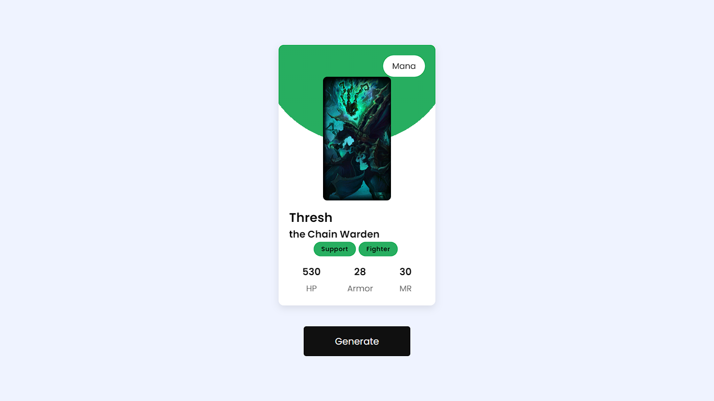
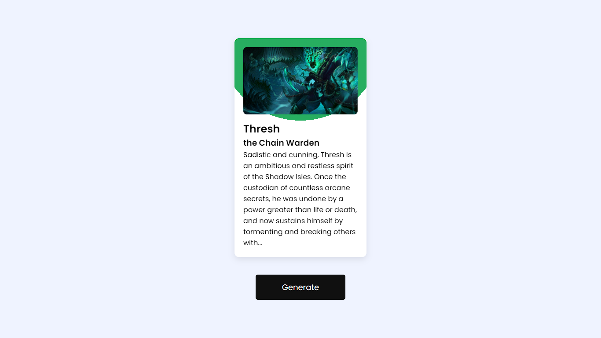

# Random Champion Generator

Welcome to my portfolio project, the Random Champion Generator! This project showcases my skills using HTML5, CSS3, and JavaScript (ES6+) to create a simple web application.

## Table of Contents

- [Introduction](#introduction)
- [Features](#features)
- [Technologies Used](#technologies-used)
- [Installation](#installation)
- [Usage](#usage)
- [Screenshots](#screenshots)
- [Contact](#contact)

## Introduction

This project demonstrates my ability to create a responsive and interactive web application using fundamental web technologies. It generates random champion suggestions based on user input. I integrated Riot's API to fetch champion data, learning how to utilize APIs effectively.

## Features

- **Random Champion Generation:** Generates random champion suggestions.
- **Simple and Clean UI:** Designed with responsive HTML, styled with CSS, and enhanced with JavaScript.
- **API Integration:** Utilizes Riot's API to fetch champion data dynamically.
- **Easy to Use:** Straightforward interface for seamless user interaction.

## Technologies Used

- **HTML5:** Markup language for structuring the web content.
- **CSS3:** Stylesheet language for designing the layout and appearance.
- **JavaScript (ES6+):** Scripting language for interactivity and logic.
- **Riot's API:** Integration for fetching champion data.
- **Git:** Version control system for managing project codebase.

## Installation

1. Clone the repository:
   ```bash
   git clone https://github.com/TugaGelo/Random-Champion-Generator.git
2. Navigate to the project directory:
   ```bash
   cd Random-Champion-Generator
3. Install the dependencies:
   ```bash
   npm install
## Usage

1. Open index.html in your web browser.
  
3. Use the application to generate random champion suggestions.

## Screenshots





## Contact

Email: rolandtugaoen@gmail.com

LinkedIn: [LinkedIn](https://www.linkedin.com/in/rabtugaoen/)

GitHub: [GitHub](https://github.com/TugaGelo)

Portfolio: [My Website](https://roland-tugaoen-portfolio.vercel.app)

Feel free to reach out if you have any questions or suggestions!

